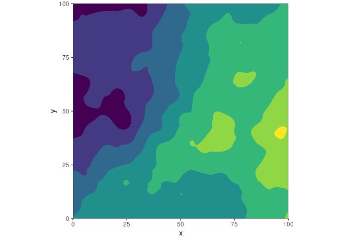
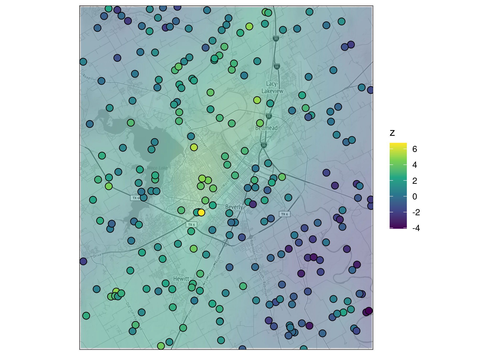

<!-- README.md is generated from README.Rmd. Please edit that file -->

# ggspatreg

<!-- badges: start -->
<!-- badges: end -->

**ggspatreg** extends **ggplot2**, allowing for simple visualization of
spatial regression models.

## Installation

**ggspatreg** is being actively developed, and is likely to undergo
large changes in the future. It is not available on CRAN, but you can
install the development version:

``` r
if (!requireNamespace("remotes")) install.packages("remotes")
remotes::install_github("jamesotto852/ggspatreg")
```

## Simple Examples

First, we simulate some spatially correlated data with `geoR::grf()`:

``` r
library("tidyverse"); theme_set(theme_bw())
library("ggspatreg")

set.seed(1)

grid <- expand_grid(x = 0:100, y = 0:100) 

df <- slice_sample(grid, n = 600) 
df$z <- geoR::grf(grid = df, cov.model = "exp", cov.pars = c(5, 30), nugget = 1)$data

ggplot(df, aes(x, y, fill = z)) +
  geom_point(shape = 21, size = 3) +
  scale_fill_viridis_c() +
  coord_fixed()
```


Now, we can use `geom_krige()` to plot the resulting interpolated
kriging surface. By default, an exponential covariance model is used.
This can be changed via the `model` argument.

``` r
ggplot(df, aes(x, y)) +
  geom_krige(aes(z = z)) +
  geom_point(aes(fill = z), shape = 21, size = 3) +
  scale_fill_viridis_c() +
  coord_fixed(xlim = c(0, 100), ylim = c(0, 100), expand = FALSE)
```


Also included are `geom_krige_contour()` and
`geom_krige_contour_lines()`:

``` r
ggplot(df, aes(x, y, z = z)) +
  geom_krige_contour(bins = 6, show.legend = FALSE) +
  scale_fill_viridis_d() +
  coord_fixed(xlim = c(0, 100), ylim = c(0, 100), expand = FALSE)

ggplot(df, aes(x, y, z = z)) +
  geom_krige_contour_lines(bins = 6, show.legend = FALSE) +
  scale_color_viridis_d() +
  coord_fixed(xlim = c(0, 100), ylim = c(0, 100), expand = FALSE)
```


------------------------------------------------------------------------

In **ggspatreg**, it is also possible to model spatially correlated data
with trends. Let’s add a simple linear trend to the previously simulated
data:

``` r
df <- mutate(df, z = z + 3/20 * x - 1/20 * y)
  
ggplot(df, aes(x, y, fill = z)) +
  geom_point(shape = 21, size = 3) +
  scale_fill_viridis_c() +
  coord_fixed()
```


When `formula` is provided, `geom_krige()` models both the spatial
dependence and the specified linear relationship.

``` r
ggplot(df, aes(x, y)) +
  geom_krige(aes(z = z), formula = z ~ x + y) +
  geom_point(aes(fill = z), shape = 21, size = 3) +
  coord_fixed(xlim = c(1, 100), ylim = c(1, 100), expand = FALSE) +
  scale_fill_viridis_c()
```


Again, we can do the same thing with contours:

``` r
ggplot(df, aes(x, y, z = z)) +
  geom_krige_contour(bins = 8, formula = z ~ x + y, show.legend = FALSE) +
  scale_fill_viridis_d() +
  coord_fixed(xlim = c(0, 100), ylim = c(0, 100), expand = FALSE)

ggplot(df, aes(x, y, z = z)) +
  geom_krige_contour_lines(bins = 8, formula = z ~ x + y, show.legend = FALSE) +
  scale_color_viridis_d() +
  coord_fixed(xlim = c(0, 100), ylim = c(0, 100), expand = FALSE)
```



## Latitude/Longitude Data

**ggspatreg** works well with latitude longitude data. Below, we
simulate spatial data for coordinates in Waco, TX.

``` r
set.seed(1)

df <- tibble(
  lon = runif(250, -97.3, -97),
  lat = runif(250, 31.4, 31.7),
  z = geoR::grf(grid = cbind(lon, lat), cov.model = "exp", cov.pars = c(3, .1), nugget = 1)$data
) 
#> grf: simulation on a set of locations provided by the user
#> grf: process with  1  covariance structure(s)
#> grf: nugget effect is: tausq= 1 
#> grf: covariance model 1 is: exponential(sigmasq=3, phi=0.1)
#> grf: decomposition algorithm used is:  cholesky 
#> grf: End of simulation procedure. Number of realizations: 1
```

Below, we set up **ggmap** and visualize our sample points:

``` r
library("ggmap")

theme_update(
  axis.title = element_blank(),
  axis.text = element_blank(),
  axis.ticks = element_blank() 
)

waco_map <- get_map(location = c(-97.3, 31.4, -97, 31.7), color = "bw")

ggmap(waco_map) +
  geom_point(data = df, aes(lon, lat, fill = z), shape = 21, size = 3) +
  guides(color = guide_legend(), size = guide_legend()) +
  scale_fill_viridis_c()
```


It is simple to include kriging layers on top of ggmap raster images, we
need only adjust `alpha`:

``` r
ggmap(waco_map) +
  geom_krige(data = df, aes(lon, lat, z = z), alpha = .4) +
  geom_point(data = df, aes(lon, lat, fill = z), shape = 21, size = 3) +
  scale_fill_viridis_c()
```



``` r
ggmap(waco_map) +
  geom_krige_contour(data = df, aes(lon, lat, z = z), alpha = .4, bins = 7) +
  scale_fill_viridis_d()
```


``` r
ggmap(waco_map) +
  geom_krige_contour_lines(data = df, aes(lon, lat, z = z), bins = 7) +
  scale_fill_viridis_d()
```


